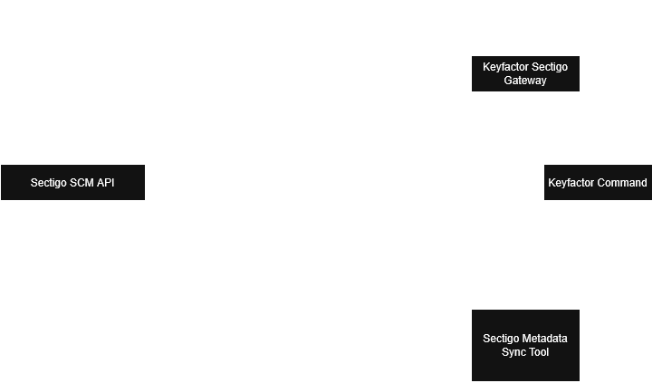
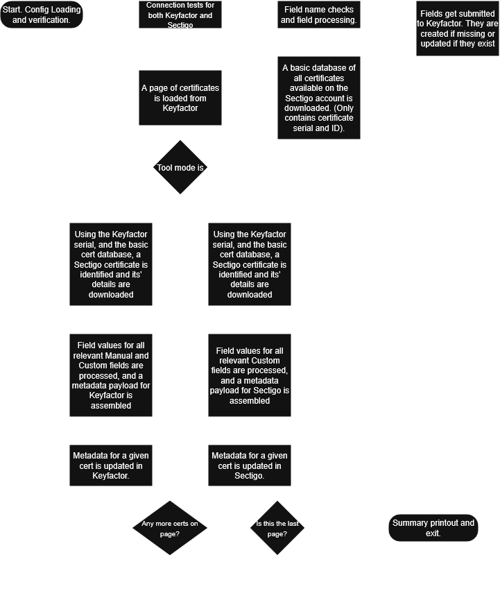

<h1 align="center" style="border-bottom: none">
    Sectigo Metadata Sync
</h1>

<p align="center">
  <!-- Badges -->

<a href="https://github.com/Keyfactor/sectigo-metadata-sync-dev/releases"></a>


</p>

<p align="center">
  <!-- TOC -->
  <a href="#support">
    <b>Support</b>
  </a> 
  ·
  <a href="#license">
    <b>License</b>
  </a>
  ·
  <a href="https://github.com/topics/keyfactor-integration">
    <b>Related Integrations</b>
  </a>
</p>

## Support
The Sectigo Metadata Sync is open source and there is **no SLA**. Keyfactor will address issues as resources become available. Keyfactor customers may request escalation by opening up a support ticket through their Keyfactor representative. 

> To report a problem or suggest a new feature, use the **[Issues](../../issues)** tab. If you want to contribute actual bug fixes or proposed enhancements, use the **[Pull requests](../../pulls)** tab.


## Overview

This tool performs the synchronization of metadata fields and their contents between Sectigo and Keyfactor. It has two modes of operation:

1. **SCtoKF** – Synchronizes custom fields and contained data, and additional requested data from Sectigo into Keyfactor. 
2. **KFtoSC** – Synchronizes custom field data from Keyfactor back to Sectigo. 

Fields listed in `fields.json` that do not already exist in Keyfactor will be created automatically if they do not already exist, and updated otherwise.
> **Note:** Certificates must already be imported into Keyfactor for metadata synchronization to work. The tool does *not* import the certificates themselves, and functions separately from the Sectigo Gateway. The tool does not need to be installed on the same server as Keyfactor Command or the Sectigo Gateway, but needs API access to both Command and the Sectigo SCM API.

## Installation and Usage

1. **Prerequisites**
   * .NET 9 runtime, installed through the hosting package.
   * A valid Sectigo account with API access credentials.
   * A Keyfactor account with API access credentials for use with basic authentication, or OAuth token retrieval data if OAuth authentication is used (see OAuth login section in this manual for specific details).
   * The following config files set up within the `config` sub-directory:

     * `config.json`
     * `fields.json`
     * `bannedcharacters.json`, which will be generated during the first run if needed.
    
   * The tool has been designed for Keyfactor 25.3, but has been tested as compatible with older versions.

2. **Running the Tool**
   ```powershell
   SectigoMetadataSync.exe sctokf
   ```

   or

   ```powershell
   SectigoMetadataSync.exe kftosc
   ```
  > **Note:** SCtoKF sync must be run at least once before KFtoSC can be. Please carefully review all the available configuration options below before running the tool, as some settings may irreversibly impact existing data.

## Settings

### The Philosophy of Manual Fields and Custom Fields

Manual Fields is a term used to represent fields containing data from “static” Sectigo certificate attributes (e.g., externalRequester, reasonCode) obtained when using the Sectigo API "Get SSL certificate details" endpoint for a given certificadte into Keyfactor. 
This is useful in cases where certain data is not automatically loaded into Keyfactor when the certificate is imported via the Sectigo Gateway, but you wish to have it stored in Keyfactor regardless using a Keyfactor Metadata Field.

Custom Fields is a term used to represent Sectigo custom fields, which are user-defined fields, and exist in Sectigo the same way Metadata Fields exist in Keyfactor. 

These terms are only used in the context of this tool, and do not represent any official terminology from either Sectigo or Keyfactor, but are useful to differentiate between the two different scenarios that occur during synchronization.

### 1.`config\config.json` Settings

* **sectigoLogin**
  Login name/email for Sectigo API (e.g., the account you use to log into Sectigo).

* **sectigoPassword**
  Password for the Sectigo account.

* **sectigoCustomerUri**
 This is a static value that determines the customer's account on the Certificate Platform. This can be found as part of the portal login URL `https://hard.cert-manager.com/customer/{CustomerUri}`

* **sectigoAPIUrl**
  Base URL for Sectigo’s API (e.g., `https://cert-manager.com`).

* **keyfactorLogin**
  Keyfactor domain and username, in the form `DOMAIN\\Username`. If using OAuth authentication, this can be set to `null`. The Keyfactor account must have API access and permissions to create/update metadata fields, and alter certificate data.

* **keyfactorPassword**
  Password for the Keyfactor account. If using OAuth authentication, this can be set to `null`.

* **keyfactorAPIUrl**
  Full Keyfactor API endpoint (e.g., `https://your-keyfactor-server.com/keyfactorapi`). This applies to both basic and OAuth authentication. 

* **keyfactorDateFormat**
  Date/time format to use when reading Date information from Keyfactor for SCtoKF mode. Varies based on your Keyfactor Command version.
  Default for Keyfactor 25.1 is "M/d/yyyy h:mm:ss tt". Older versions may use "yyyy-MM-dd". 
  In case of errors, please review the logs to obtain the correct format.
    

* **importAllCustomFields**
  String `"true"` or `"false"`.

  * If `"true"`, on `SCtoKF` mode the tool will import *all* custom metadata fields that exist in Sectigo, and use autofill with banned characters replacement to convert field names.
  * If `"false"`, it will only import the ones explicitly listed under `"CustomFields"` in `fields.json`, and will not alter their names. The tool will still check for banned characters, and will
    generate an error if any are found.

* **syncRevokedAndExpiredCerts**
  String `"true"` or `"false"`.

  * If `"true"`, certificates with status “revoked” or “expired” in Sectigo and Keyfactor will also be included for metadata sync.
  * If `"false"`, those certificates are skipped.

* **issuerDNLookupTerm**
  A substring to match against the Issuer Distinguished Name, which is how the tool identifies Sectigo-issued certificates in Keyfactor.

  * Only certificates whose Issuer DN contains this term (e.g., `"Sectigo"`) will be considered. Certificates that are not present in your Sectigo account will be ignored, and their metadata will not be altered.

* **enableDisabledFieldSync**
  String `"true"` or `"false"`.

  * If `"true"`, fields in Sectigo that are marked “disabled” will still be synchronized. In practice, the fields will be created in Keyfactor but not populated with data, as the data is not returned by Sectigo if the field is inactive.
  * If `"false"`, disabled fields are ignored.

* **sslTypeIds**
  Array of integers specifying which Sectigo SSL certificate Type IDs should be queried. (sslTypeIds). These would be the same used for the Keyfactor Gateway Configuration.
  Example: `[ 111111, 222222 ]` might correspond to “Domain Validated”, “Organization Validated”, etc.

  * Only certificates whose `sslType` matches one of these IDs are processed.

* **sectigoPageSize**
  Maximum number of certificates to fetch per page from Sectigo (pagination).
  Default is `25`.

* **keyfactorPageSize**
  Maximum number of certificates to fetch per page from Keyfactor (pagination).
  Default is `100`.

* **keyfactorAddedSince**
  Allows you to specify a date that will be used to limit the sync to certificates imported into Keyfactor after that date.
  For example, if you specify `"2023-09-01"`, only certificates added to Keyfactor after September 1, 2023 will be considered for metadata sync.
  If you wish to sync all certificates, use the value of `null`.

* **enableTruncation**
  This setting controls data truncation to comply with Sectigo and Keyfactor field length character limits.
  Keyfactor specifies the Keyfactor limits in their documentation [here](https://software.keyfactor.com/Core-OnPrem/v25.3/Content/ReferenceGuide/CreatingaMetadataField.htm#_Ref498525440) and Sectigo specifies the limits in their API documentation [here](https://www.sectigo.com/knowledge-base/detail/Sectigo-Certificate-Manager-SCM-REST-API/kA01N000000XDkE).
  The Keyfactor length limits are varied depending on the field data type, and Sectigo custom fields have a maximum length of 255 characters.  

  You may run into these limits when attempting to sync `Custom Field` data from Keyfactor to Sectigo, but also when trying to sync a `Manual Field` from Sectigo to Keyfactor, as the data retrieved from the Sectigo "Get SSL certificate details" endpoint may technically exceed the limits for either system.

  If this setting is set to `true`, the tool will automatically truncate data to fit within the limits when writing to either system. 
  
  ⚠️ WARNING: *If you sync the data to Keyfactor (in SCtoKF mode) and it ends up getting truncated, and then sync the data back to Sectigo (in KFtoSC), the portion that was truncated will be permanently lost. The same applies in reverse. To avoid this scenario, be mindful of running sync both ways when you have data exceeding character length limits for either Keyfactor or Sectigo. Review the logs following sync to identify any truncation related issues early.*

  If this setting is set to `false`, the tool will ignore any data that exceeds the limits and will log a warning. The original value will be used and will likely result in an error, as well as the value not getting synced.

If you are using OAuth authentication for Keyfactor, the following section must be present (and must be absent if you are using basic authentication, see `stock-config-oauth.json` for OAuth and `stock-config.json` for basic auth):

* **keyfactorOAuth**
    * **tokenUrl**
    The URL to retrieve the token from. This tool has been tested for use with Keyfactor using both Keycloak and Auth0 to obtain tokens.
    
    * **clientId**
    Token client id.

    * **clientSecret**
    Token client secret.

    * **scopesCsv**
    Comma separated list of scopes to request the token for, can be left blank.

    * **audience** 
    Token audience.

    * **requestedWith**
    String to specify the requested with header value for all OAuth related requests.

    * **refreshSkewSeconds**
    Default is 60 seconds. This is the amount of time before the token expiration that the tool will attempt to refresh the token. If a refresh time is returned with the token, and that value exceeds the value given here, the returned value will be used instead.

### 2. `config\fields.json` Settings
* **ManualFields**
  This is a json list of objects defining Sectigo *static* fields to be synchronized.
  Each object must include:

  1. `sectigoFieldName`

     * The exact JSON path of the field in Sectigo’s “Get SSL certificate details” response.
     * Use dot notation if nested (e.g., `'certificate.subject.organization'`).
  2. `keyfactorMetadataFieldName`

     * The desired metadata field name in Keyfactor. **Must contain only `[A–Za–z0–9-_]`.**
  3. `keyfactorDescription`

     * A short description for display in Keyfactor’s UI.
  4. `keyfactorDataType`

     * Integer code for Keyfactor’s data type:

       * `1` = String
       * `2` = Integer
       * `3` = Date
       * `4` = Boolean
       * `5` = MultipleChoice
       * `6` = BigText
       * `7` = Email
  5. `keyfactorHint`

     * Hint text shown in Keyfactor when entering or viewing data.
  6. `keyfactorValidation` (nullable)

     * A regular expression that the input must match (only for string fields).
  7. `keyfactorEnrollment`

     * How the field behaves during enrollment. Valid values depend on your Keyfactor setup (typically `0` = optional, `1` = required).
  8. `keyfactorMessage` (nullable)

     * Message shown if validation fails.
  9. `keyfactorOptions` (nullable)

     * Array of strings for multiple‐choice fields. Ignored if `keyfactorDataType` ≠ `5`.
  10. `keyfactorDefaultValue` (nullable)

      * Default value for the metadata field.
  11. `keyfactorDisplayOrder`

      * Integer specifying the display order in the Keyfactor administration view.
  12. `keyfactorCaseSensitive`

      * `true` or `false`. Only relevant if `keyfactorValidation` is provided for a string field.

* **CustomFields**
 Uses the same fields as above. An array of objects defining Sectigo *custom* fields to be synchronized. If `importAllCustomFields = true` (in `stock-config.json`), you may omit individual entries here and let the tool import all custom fields automatically.

### Use Guidelines for `config.json`

To retrieve data via a Manual Field, you specify the path to the attribute from the Sectigo "Get SSL certificate details" in the sectigoFieldName in the `ManualFields` section in `fields.json`, using `.` to address into additional layers of objects. For example, to have `certificateDetails.issuer`
imported into Keyfactor as a metadata field, list `certificateDetails.issuer` as the `sectigoFieldName` for a given field. 
For an object retrieved from the Sectigo API, you will only be able to store one leaf (lowest level) attribute per Keyfactor metadata field. If an object is a list, the Metadata Sync Tool will attempt to store the entire list as a comma-separated string.
Review the [Sectigo API](https://www.sectigo.com/knowledge-base/detail/Sectigo-Certificate-Manager-SCM-REST-API/kA01N000000XDkE) documentation for the SSL "Get SSL certificate details" endpoint to view all of the available attributes and objects.    

If `importAllCustomFields` is set to true, the tool will attempt to match the field types between Keyfactor and Sectigo when it creates the fields within Keyfactor.
Otherwise, information listed for each field specified in the CustomFields array within `fields.json` will be used to create the fields within Keyfactor.
It is recommended to only use `importAllCustomFields` in cases where you have a very large number of custom fields in Sectigo and do not wish to manually list them all in `fields.json`. 
Using `fields.json` is the preferred method, as it provides granular control over metadata field settings.

Additional information on what attributes like `keyfactorDataType` and `keyfactorValidation` represent, as well as details of other configuration options can be found in the [Keyfactor Metadata Field API Endpoint documentation](https://software.keyfactor.com/Core-OnPrem/v25.2/Content/WebAPI/KeyfactorAPI/MetadataFieldsPost.htm).
> **Note:**  The Keyfactor fields supported by this tool are compatible with Keyfactor Command 25.1, 
but the tool will work with older versions of Keyfactor and the unused fields and contained data will be ignored.

> **Note:**  Set the value of all parameters you are not using to `null`.

### 3. config\bannedcharacters.json

On the very first run, the tool inspects all Sectigo custom field names and compares them against Keyfactor’s allowed metadata‐field naming rules (alphanumeric, `-`, and `_` only). If it finds unsupported characters, it will produce a file called `bannedCharacters.json` in the same directory, with entries like:

```jsonc
[
  {
    "id": 1,
    "character": " ",
    "replacementCharacter": null
  },
  {
    "id": 2,
    "character": "/",
    "replacementCharacter": null
  }
]
```

* **character**
  The unsupported character detected in the Sectigo field name.

* **replacementCharacter** (initially `null`)
  A value you must supply before rerunning. It should be any alphanumeric, `-`, or `_` string that the tool can use to replace the banned character.
  For example, to replace spaces (`" "`) with underscores (`"_"`), set `"replacementCharacter": "_"`.

If any `"replacementCharacter"` remains `null`, the tool will exit with an error on the next run. Once you populate all replacements, fields will be created in Keyfactor with names free of banned characters.

If you are using `importAllCustomFields = false`, the tool will still check for banned characters in the `CustomFields` listed in `fields.json`, and will generate an error if any are found, and will also create `bannedCharacters.json`.
However, in this case, you should manually alter the field names in `fields.json`, then remove the `bannedCharacters.json` file, and rerun the tool.

## Command Line Arguments

One of the following two modes must be specified as the **first (and only) argument** when launching the executable:

* `sctokf`
  Synchronizes custom and manual fields **from Sectigo into Keyfactor**.

  * Reads each entry in `fields.json`.
  * For each “ManualField,” extracts the specified data from Sectigo’s certificate details JSON.
  * For each “CustomField,” reads Sectigo’s custom-field value and writes it into Keyfactor.
  * The required metadata fields are created in Keyfactor if they do not already exist.

* `kftosc`
  Synchronizes custom fields (NOT manual fields) **from Keyfactor back into Sectigo**.

  * Reads each `CustomField` entry in `fields.json`.
  * For each field, retrieves the value from Keyfactor and updates Sectigo.

> **Note:** If no argument or an invalid argument is provided, the tool will log an error and exit.

## Logging

Logging is managed via NLog and is configured in the accompanying `config\NLog.config` file. By default, logs are written to a `/logs` subdirectory under the folder containing the executable. There are two main log targets—one for all log levels and one that captures only errors and fatals.

### Logging Rules

```xml
<rules>
  <!-- All levels (DEBUG, INFO, WARN, ERROR, FATAL) go to MainLogFile -->
  <logger name="*" minlevel="Info" writeTo="MainLogFile" />

  <!-- Only ERROR and FATAL levels go to ErrorLogFile -->
  <logger name="*" minlevel="Error" writeTo="ErrorLogFile" />
</rules>
```

* **MainLogFile (`MetadataSync.log`)**
  Captures everything from `Debug` up to `Fatal`. This is the primary log for troubleshooting or auditing all operations.
  For debugging, set minlevel="Debug" or minlevel="Trace".

* **ErrorLogFile (`MetadataSync-Errors.log`)**
  Captures only `Error` and `Fatal` entries. Use this file to quickly locate failed operations without sifting through lower‐level debug or info messages.

#### Example Log Entry (MainLogFile)

```
2025-06-03 02:00:01.2345 | INFO  | SectigoMetadataSync.MetadataSync | Starting SCtoKF synchronization mode.
```

#### Example Log Entry (ErrorLogFile)

```
2025-06-03 02:05:42.9876 | ERROR | SectigoMetadataSync.SectigoClient | Failed to retrieve certificates: HTTP 401 Unauthorized.
```

---

**Tip:** If you need to change log levels or file paths, open `NLog.config` and edit:

* `<variable name="logDirectory" value="…"/>`
* `<variable name="logFileName" value="…"/>`
* `<variable name="errorFileName" value="…"/>`
* Or adjust the `<rules>` block to include/exclude other levels or targets.

Always restart the tool after modifying `NLog.config` to ensure changes take effect.

## Example Workflow

1. **Initial Setup**
Extract the zip and have the tool files in a folder (e.g., `C:\Tools\SectigoSync\`). If you want to run the tool on a schedule, consider creating a scheduled task in Windows Task Scheduler.
Make sure that the account used to run the tool has read/write permissions to the folder and subfolders.
   * Populate `config\config.json` with your Sectigo and Keyfactor API credentials, as well as other settings. The tool ships with the `stock` config files, so you should copy one of those as `config.json` and edit it.
   * Populate `config\fields.json` with the manual and/or custom fields you wish to sync.

2. **First Run (Detection of Banned Characters)**

   ```powershell
   cd C:\Tools\SectigoSync\
   .\SectigoMetadataSync.exe SCtoKF
   ```

   * If a Keyfactor field name contains banned characters, you will see warnings in the log and the tool will exit.
   * A file named `bannedcharacters.json` will be created listing each banned character with `"replacementCharacter": null`. 
     If `importAllCustomFields` is set to `  true`, populate the `bannedcharacters.json` file as detailed below. If `importAllCustomFields` is set to `false`, manually edit the field names in `fields.json`, delete `bannedcharacters.json`, and rerun the tool.

       **Populate Banned Characters**

       * Open `config\bannedcharacters.json`.
       * For each entry where `"replacementCharacter": null`, supply a valid replacement (alphanumeric, `-`, or `_`).

         ```jsonc
         [
           {
             "id": 1,
             "character": " ",
             "replacementCharacter": "_"
           },
           {
             "id": 2,
             "character": "/",
             "replacementCharacter": "-"
           }
         ]
         ```
       * Save the file.

3. **Second Run (Create Fields & Sync Data)**

   ```powershell
   .\SectigoMetadataSync.exe SCtoKF
   ```

   * The tool will now convert Sectigo custom‐field names (using your replacements) if `importAllCustomFields` is enabled, create new Keyfactor metadata fields if needed (and update them otherwise), and write all custom/manual field data into Keyfactor.

## Data Flow


The Metadata Sync Tool operates independently of the Sectigo Gateway and does not require installation on the same server as Keyfactor Command or the Sectigo Gateway. It requires API access to both systems.

## Tool Process Diagram


## Value Coercion
When syncing data between Keyfactor and Sectigo, the tool attempts to coerce values to match the expected data types in the target system. 

For example, if a Keyfactor metadata field is of type `Date`, the tool will try to parse the string value from Keyfactor into a date format that Sectigo accepts (typically `yyyy-MM-dd`).

If you set up a field in Keyfactor as email, and the data exists as a string in Sectigo, Keyfactor will attempt to parse the values from Sectigo, validate them as email addresses, and submit them to Keyfactor as a properly formatted email list.

The truncation process occurs at this stage of the process as well, if enabled in `config.json`.

## Troubleshooting

* **Missing or Invalid JSON**

  * If `config.json` or `fields.json` is malformed or missing required sections, the tool logs an error and exits.
  * Ensure both files exist, are valid JSON, and contain the required properties (see “Settings” above).

* **Authentication Failures**

  * Double‐check `sectigoLogin`/`sectigoPassword` and `keyfactorLogin`/`keyfactorPassword`.
  * If you are using OAuth, consider using Postman to test your OAuth credentials and ensure token retrieval works as expected.
  * Ensure your API user has adequate permissions to create/update metadata fields.

* **Field Creation Errors**

  * If Keyfactor rejects a field name (e.g., still contains a banned character), verify that `bannedCharacters.json` is up to date.
  * If Sectigo rejects a custom‐field update, ensure you are using the correct custom‐field “name” as visible in Sectigo’s administration UI.
  * Consider deleting 'bannedCharacters.json' and re-running the tool to regenerate it from scratch.
  
* **Keyfactor metadata field type update failure**

  * Keyfactor will not allow updating the data type of an existing metadata field. If you need to change the data type, you must delete the existing field in Keyfactor and let the tool recreate it.

* **Field content truncation**

  * Both Keyfactor and Sectigo impose maximum lengths on metadata field names and values. If you see warnings about truncation in the logs, consider truncating the data manually prior to running sync. These limits can be found in the respective product documentation for [Keyfactor](https://software.keyfactor.com/Core-OnPrem/v25.3/Content/ReferenceGuide/CreatingaMetadataField.htm#_Ref498525440) and [Sectigo](https://www.sectigo.com/knowledge-base/detail/Sectigo-Certificate-Manager-SCM-REST-API/kA01N000000XDkE).

* **Account permission issues**
  * Ensure the API user accounts have permissions to edit certificate details and edit metadata fields.
  * If you are running into these issues, you can try running the tool using an admin account and see if you can match the required permissions.

* **API Access issues**
  * Ensure that the API endpoints specified in `config.json` are correct and reachable from the machine running the tool. Sometimes a missing slash or typo can cause connection issues.
  * Check for network issues, firewalls, or proxies that might be blocking access.
  * Consider using Postman or a similar tool to manually test the API endpoint connectivity.


## License

Apache License 2.0, see [LICENSE](LICENSE).

## Related Integrations

See all [Keyfactor integrations](https://github.com/topics/keyfactor-integration).